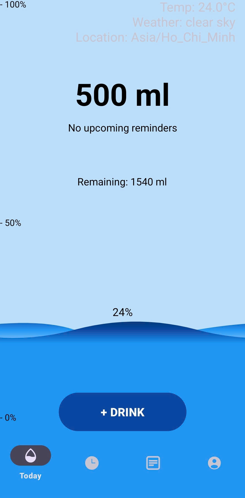

# Water-Tracking-Android-App



## Giới thiệu

Ứng dụng theo dõi lượng nước uống hàng ngày cho Android, hỗ trợ đồng bộ với thiết bị đeo (Wear OS) và chai nước thông minh qua Bluetooth.

## Tính năng chính

### 📱 Cuoi Ky - Ứng dụng chính (Mobile App)
- **Theo dõi lượng nước**: Ghi nhận và theo dõi lượng nước uống hàng ngày
- **Lịch sử**: Xem lại lịch sử uống nước theo ngày với `HistoryDayFragment`
- **Nhắc nhở thông minh**: Thiết lập lời nhắc uống nước với `RemindActivity` và `ReminderBroadcastReceiver`
- **Thông báo**: Nhận thông báo nhắc nhở qua `NotificationActivity` và chạy nền với `ForegroundService`
- **Phân tích thông minh**: Xem các thống kê và phân tích với `Insight` và `InsightDatabase`
- **Bảng xếp hạng**: So sánh với bạn bè qua `LeaderboardActivity`
- **Huy hiệu thành tích**: Nhận huy hiệu khi đạt mục tiêu với `BadgesActivity`
- **Đăng nhập Google**: Xác thực người dùng qua `SignInActivity`
- **Email thông báo**: Gửi báo cáo qua email với `EmailSender`
- **Kết nối đồng bộ**: Đồng bộ dữ liệu với Wear OS qua `PhoneDataListenerService`
- **Giao diện đẹp mắt**: Hiệu ứng sóng nước với `WaveView` và ảnh tròn với `CircularImageView`
- **Cơ sở dữ liệu**: Quản lý dữ liệu với SQLite qua `DatabaseHelper`, `AlarmDatabaseHelper`
- **Firebase Integration**: 
  - Firebase Authentication
  - Firebase Realtime Database
  - Firebase Firestore
  - Google Play Services Location
- **Xuất dữ liệu**: Xuất báo cáo Excel (Apache POI) và PDF (iTextPDF)
- **Biểu đồ**: Hiển thị thống kê với MPAndroidChart
- **Lottie Animations**: Hiệu ứng động đẹp mắt

### ⌚ watch - Ứng dụng Wear OS
- **Giao diện đồng hồ**: Theo dõi nước trực tiếp trên đồng hồ thông minh
- **Tiến trình vòng tròn**: Hiển thị tiến độ với `CircularProgressView`
- **Đồng bộ hai chiều**: Kết nối với ứng dụng chính qua Google Play Services
- **Theo dõi sức khỏe**: Tích hợp Google Fit API để theo dõi hoạt động
- **Cơ sở dữ liệu độc lập**: Lưu trữ cục bộ với `DatabaseHelper`
- **Firebase Sync**: Đồng bộ dữ liệu với cloud
- **Wear UI Components**: 
  - Wear Input support
  - Ongoing notifications
  - Phone interactions
  - Remote interactions
- **Health Connect**: Tích hợp với Health Connect API
- **MPAndroidChart**: Biểu đồ tối ưu cho màn hình nhỏ

### 🍶 bottel - Mô phỏng chai nước thông minh
- **BLE Server**: Hoạt động như thiết bị ngoại vi Bluetooth Low Energy
- **Quảng bá BLE**: Phát sóng thông tin chai nước qua Bluetooth
- **GATT Server**: Cung cấp dịch vụ GATT với đặc tính tùy chỉnh
- **Gửi dữ liệu**: Truyền thông tin lượng nước đến app chính
- **Giao diện điều khiển**: SeekBar để mô phỏng lượng nước trong chai
- **Theo dõi kết nối**: Hiển thị trạng thái kết nối với ứng dụng
- **UUID tùy chỉnh**: 
  - Service UUID: `0000abcd-0000-1000-8000-00805f9b34fb`
  - Characteristic UUID: `0000dcba-0000-1000-8000-00805f9b34fb`

## Kiến trúc hệ thống

```
┌─────────────────┐         Bluetooth LE          ┌──────────────────┐
│   bottel App    │ ◄──────────────────────────► │  Cuoi Ky App     │
│ (BLE Peripheral)│         GATT Protocol         │  (BLE Central)   │
└─────────────────┘                               └──────────────────┘
                                                           ▲
                                                           │
                                                           │ Wearable Data Layer
                                                           │ (Google Play Services)
                                                           │
                                                           ▼
                                                   ┌──────────────────┐
                                                   │   watch App      │
                                                   │   (Wear OS)      │
                                                   └──────────────────┘
```

## Công nghệ sử dụng

- **Ngôn ngữ**: Java
- **SDK**: Android SDK 35 (compileSdk)
- **Min SDK**: 24-26 (tùy module)
- **Build System**: Gradle (Kotlin DSL)
- **Database**: SQLite
- **Cloud Services**: 
  - Firebase (Auth, Database, Firestore)
  - Google Sign-In
  - Gmail API
- **Bluetooth**: BLE (Bluetooth Low Energy)
- **Wearable**: Google Play Services Wearable
- **Charts**: MPAndroidChart v3.1.0
- **Image Loading**: Picasso, Glide
- **Export**: Apache POI (Excel), iTextPDF
- **Animation**: Lottie
- **Health**: Google Fit API, Health Connect

## Yêu cầu hệ thống

- Android 7.0 (API 24) trở lên
- Bluetooth 4.0+ (cho tính năng kết nối chai thông minh)
- Wear OS 2.0+ (cho tính năng đồng hồ)
- Kết nối Internet (cho đồng bộ Firebase và Google Services)

## Cài đặt

1. Clone repository:
```bash
git clone https://github.com/LuuGiaPhu/Water-Tracking-Android-App.git
```

2. Mở project trong Android Studio

3. Cấu hình Firebase:
   - Thêm file `google-services.json` vào thư mục `Cuoi ky/app/`
   - Cấu hình Firebase Authentication và Database

4. Build và chạy từng module:
   - **Cuoi Ky**: Ứng dụng chính trên điện thoại
   - **bottel**: Mô phỏng chai nước (chạy trên thiết bị khác)
   - **watch**: Ứng dụng Wear OS (deploy lên đồng hồ)

## Cách sử dụng

### Kết nối chai thông minh
1. Chạy app **bottel** trên một thiết bị
2. Mở app **Cuoi Ky** trên thiết bị chính
3. Bật Bluetooth và cho phép quyền cần thiết
4. App sẽ tự động tìm và kết nối với chai

### Đồng bộ với Wear OS
1. Đảm bảo đồng hồ và điện thoại đã ghép nối
2. Cài đặt app **watch** lên đồng hồ
3. Mở app **Cuoi Ky** trên điện thoại
4. Dữ liệu sẽ tự động đồng bộ giữa hai thiết bị

## Cấu trúc dự án

```
Water-Tracking-Android-App/
├── Cuoi ky/              # Ứng dụng Android chính
│   ├── app/
│   │   └── src/main/java/com/example/myapplication/
│   │       ├── MainActivity.java
│   │       ├── SignInActivity.java
│   │       ├── DatabaseHelper.java
│   │       ├── WaveView.java
│   │       └── ...
├── bottel/               # Mô phỏng chai nước BLE
│   └── app/
│       └── src/main/java/com/example/smartwaterbottlesim/
│           └── MainActivity.java
├── watch/                # Ứng dụng Wear OS
│   └── wear/
│       └── src/main/java/com/example/myapplication/
│           ├── WearMainActivity.java
│           ├── CircularProgressView.java
│           └── ...
└── README.md
```

## Screenshots


## Đóng góp

Mọi đóng góp đều được chào đón! Vui lòng:
1. Fork repository
2. Tạo branch mới (`git checkout -b feature/AmazingFeature`)
3. Commit changes (`git commit -m 'Add some AmazingFeature'`)
4. Push to branch (`git push origin feature/AmazingFeature`)
5. Mở Pull Request

## Tác giả

**Luu Gia Phu**
- GitHub: [@LuuGiaPhu](https://github.com/LuuGiaPhu)

## License

Dự án này được phát triển cho mục đích học tập.

## Ghi chú

- Đảm bảo cấu hình đúng Firebase trước khi chạy
- Cần cấp quyền Bluetooth, Location để kết nối BLE
- File `local.properties` chứa cấu hình SDK path (không commit lên Git)
- File `google-services.json` cần được thêm vào mỗi module sử dụng Firebase
